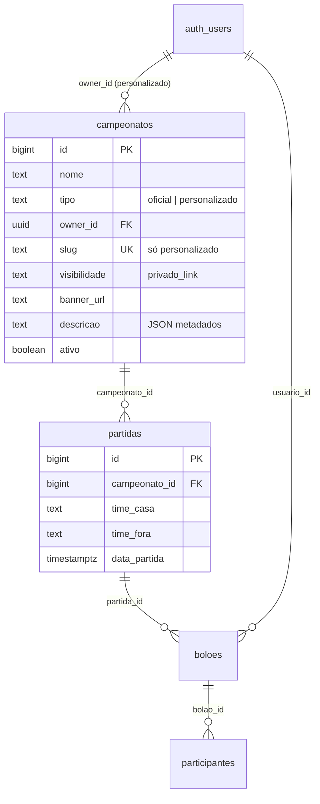
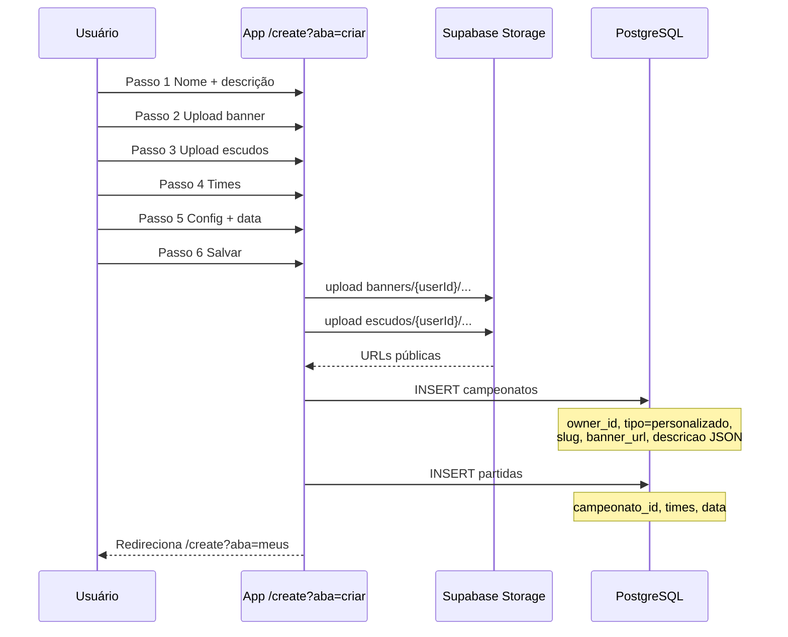

# Campeonato personalizado — documentação do banco de dados

Este documento descreve o modelo de dados, as regras de visibilidade e o fluxo **Criar meu campeonato** no Palpite Gol.

---

## 1. Objetivo

Permitir que o usuário crie campeonatos próprios (ex.: *Zé Ruan*, *Churrasco da Galera*, *Pelada de Domingo*) com:

- fotos enviadas (banner + escudos) — **sem links externos**;
- dono identificado (`owner_id`);
- visibilidade **privada por link**: o campeonato **não aparece em listagens públicas** e só é acessível para:
  - o **dono** (aba **Meus**);
  - quem receber o **link de convite** (`slug` único).

---

## 2. Regra de ouro — visibilidade

| Quem | O que vê |
|------|----------|
| Visitante anônimo | Apenas campeonatos `tipo = 'oficial'` (Copa 2026, etc.) |
| Usuário logado (geral) | Oficiais + **somente os personalizados que ele criou** |
| Dono do campeonato | Todos os seus personalizados na aba **Meus** |
| Pessoa com o link | **Apenas aquele** campeonato (via `slug`), sem ver os de outros usuários |

**O campeonato personalizado NUNCA deve:**

- aparecer na aba **Oficiais**;
- aparecer na aba **Meus** de outro usuário;
- ser listado em `SELECT * FROM campeonatos WHERE tipo = 'personalizado'` para quem não é o dono.

**O campeonato personalizado SÓ é descoberto por:**

1. `owner_id = auth.uid()` (painel do dono), ou  
2. link direto: `/campeonato?c={slug}` (RPC `get_campeonato_por_link`).

---

## 3. Diagrama de relacionamento



---

## 4. Tabela `public.campeonatos`

### 4.1 Colunas — personalizado vs oficial

| Coluna | Oficial | Personalizado | Descrição |
|--------|---------|---------------|-----------|
| `id` | ✓ | ✓ | Chave primária |
| `nome` | ✓ | ✓ | Nome exibido (ex.: *Zé Ruan*) |
| `tipo` | `'oficial'` | `'personalizado'` | Separa abas Oficiais / Meus |
| `api_league_id` | preenchido | `NULL` | ID da liga externa (Copa 2026) |
| `owner_id` | `NULL` | `auth.users.id` | Dono — obrigatório no personalizado |
| `slug` | `NULL` | único, obrigatório | Token do link de convite |
| `visibilidade` | — | `'privado_link'` | Só acesso por link (+ dono) |
| `banner_url` | opcional | URL no Storage | Foto de capa enviada |
| `descricao` | opcional | JSON | Texto + URLs dos escudos |
| `ativo` | ✓ | ✓ | `true` ao criar |

### 4.2 Constraints

```sql
-- Oficial: sem dono
(tipo = 'oficial' AND owner_id IS NULL)
OR tipo = 'personalizado'

-- Personalizado: sempre com dono e slug
tipo <> 'personalizado' OR (owner_id IS NOT NULL AND slug IS NOT NULL)
```

### 4.3 Campo `descricao` (JSON)

Metadados do wizard **Criar Campeonato** (escudos, configurações):

```json
{
  "texto": "Pelada de domingo com a galera",
  "escudoCasaUrl": "https://.../escudos/{userId}/....jpg",
  "escudoForaUrl": "https://.../escudos/{userId}/....jpg",
  "publico": false
}
```

| Campo JSON | Origem no app | Onde fica |
|------------|---------------|-----------|
| `texto` | Passo 1 — descrição | `descricao` |
| `escudoCasaUrl` | Passo 3 — upload escudo time 1 | `descricao` |
| `escudoForaUrl` | Passo 3 — upload escudo time 2 | `descricao` |
| `banner` (capa) | Passo 2 — upload banner | `banner_url` |
| `publico` | Passo 5 — toggle (legado UI) | `descricao` — **não** torna o campeonato público na listagem; visibilidade real é `privado_link` |

---

## 5. Storage — fotos (`campeonatos-media`)

Bucket público para **leitura** das imagens já enviadas; **upload** só pelo dono autenticado.

| Pasta | Conteúdo | Caminho exemplo |
|-------|----------|-----------------|
| `banners/{userId}/` | Capa do campeonato | `banners/uuid/abc.jpg` |
| `escudos/{userId}/` | Escudos dos times | `escudos/uuid/def.jpg` |

**Script:** [`storage-campeonatos.sql`](./storage-campeonatos.sql)

Limites: 5 MB, tipos `jpeg`, `png`, `webp`, `gif`.

---

## 6. Tabela `public.partidas`

Cada campeonato personalizado criado pelo wizard gera **pelo menos 1 partida** (time casa × time fora).

| Coluna | Exemplo |
|--------|---------|
| `campeonato_id` | ID do campeonato criado |
| `time_casa` | Vasco |
| `time_fora` | Flamengo |
| `data_partida` | ISO do passo Config |
| `status` | `agendado` |

**Visibilidade das partidas:** segue o campeonato pai — quem não tem o link (nem é dono) **não** deve listar partidas de campeonatos personalizados de outros usuários.

---

## 7. RLS — políticas de segurança

### 7.1 `campeonatos`

| Policy | Role | Regra |
|--------|------|-------|
| `campeonatos_select_oficial` | `anon`, `authenticated` | `tipo = 'oficial' AND ativo = true` |
| `campeonatos_select_own` | `authenticated` | `tipo = 'personalizado' AND owner_id = auth.uid()` |
| `campeonatos_insert_personalizado` | `authenticated` | INSERT com `owner_id = auth.uid()` |
| `campeonatos_update_own` | `authenticated` | UPDATE só do dono |

**Não existe** policy que liste todos os personalizados para qualquer usuário.

### 7.2 Acesso por link (RPC)

Quem abre o link **não** usa `SELECT` direto na tabela (evita vazamento em listagens). Usa função controlada:

```sql
get_campeonato_por_link(p_slug text)
```

- Retorna **no máximo 1** registro;
- Só se `tipo = 'personalizado'`, `ativo = true` e `slug` confere;
- Pode ser chamada por `anon` e `authenticated`;
- **Não** expõe campeonatos de outros slugs.

**Script:** [`migration-campeonato-share-link.sql`](./migration-campeonato-share-link.sql)

### 7.3 `partidas`

| Policy | Regra |
|--------|-------|
| `partidas_select_oficial` | Partidas de campeonato oficial |
| `partidas_select_own` | Partidas de campeonato personalizado do dono |
| `partidas_insert_own_campeonato` | INSERT só se `owner_id = auth.uid()` no campeonato |

Partidas de campeonato personalizado **para convidados** via link: RPC `get_partidas_por_link(p_slug)`.

---

## 8. Fluxo — Criar meu campeonato (app → banco)



### Payload do INSERT — `campeonatos`

```typescript
{
  nome: "Zé Ruan",
  tipo: "personalizado",
  owner_id: "<uuid do usuário logado>",
  slug: "ze-ruan-a1b2c3",           // gerado no app
  visibilidade: "privado_link",
  banner_url: "https://.../banners/.../....jpg",
  descricao: '{"texto":"...","escudoCasaUrl":"...","escudoForaUrl":"..."}',
  api_league_id: null,
  ativo: true
}
```

### Server functions (código)

| Função | Arquivo | Filtro |
|--------|---------|--------|
| `listCampeonatosOficiais` | `campeonatos.server.ts` | `tipo = 'oficial'` |
| `listMyCampeonatos` | `campeonatos.server.ts` | `owner_id = usuário` |
| `createCampeonatoPersonalizado` | `campeonatos.server.ts` | grava dono + fotos + partida |
| `getCampeonatoPorLink` | *(a implementar)* | RPC por `slug` |

---

## 9. Fluxo — Compartilhar link

1. Dono abre **Meus** → card do campeonato → **Copiar link**.
2. Link gerado no app:

   ```
   https://seu-dominio.com/campeonato?c=ze-ruan-a1b2c3
   ```

3. Convidado abre o link (com ou sem login, conforme regra do produto).
4. App chama `get_campeonato_por_link('ze-ruan-a1b2c3')`.
5. Se o slug existir e estiver ativo → exibe campeonato + partidas.
6. Convidado **não** vê outros campeonatos personalizados.

O `slug` deve ser:

- único na tabela;
- difícil de adivinhar (sufixo aleatório), no mesmo espírito dos bolões (`boloes.slug`).

---

## 10. O que aparece em cada aba (resumo UX ↔ banco)

| Aba | Query / regra |
|-----|----------------|
| **Oficiais** | `tipo = 'oficial'` |
| **Criar Campeonato** | wizard → INSERT personalizado |
| **Meus** | `tipo = 'personalizado' AND owner_id = auth.uid()` |
| **Link convidado** | RPC `get_campeonato_por_link(slug)` |

---

## 11. Ordem de execução no Supabase (SQL Editor)

Execute **nesta ordem**:

| # | Arquivo | O que faz |
|---|---------|-----------|
| 1 | [`schema.sql`](./schema.sql) | Schema base (projeto novo) |
| 2 | [`seed-copa-2026.sql`](./seed-copa-2026.sql) | Copa oficial |
| 3 | [`migration-campeonatos-owner.sql`](./migration-campeonatos-owner.sql) | `owner_id`, `tipo`, `banner_url`, `descricao`, RLS base |
| 4 | [`storage-campeonatos.sql`](./storage-campeonatos.sql) | Bucket de fotos |
| 5 | [`migration-campeonato-share-link.sql`](./migration-campeonato-share-link.sql) | `slug`, `visibilidade`, RPC por link, RLS de partidas |

### Verificação rápida

```sql
-- Só oficiais na listagem pública
SELECT id, nome, tipo FROM campeonatos WHERE tipo = 'oficial';

-- Personalizados só com dono (como usuário logado no painel)
SELECT id, nome, slug, owner_id FROM campeonatos
WHERE tipo = 'personalizado' AND owner_id = auth.uid();

-- Teste de link (substitua o slug)
SELECT * FROM get_campeonato_por_link('ze-ruan-a1b2c3');
```

---

## 12. Erros comuns

| Erro | Causa | Solução |
|------|-------|---------|
| `Could not find the 'banner_url' column` (PGRST204) | Migration 3 não executada | Rodar `migration-campeonatos-owner.sql` |
| `Bucket not found` no upload | Storage não criado | Rodar `storage-campeonatos.sql` |
| `new row violates row-level security` | JWT não autenticado no INSERT | Login + `accessToken` no servidor |
| Campeonato aparece para todos | RPC/link não usado; `partidas_select_all` antiga | Rodar migration 5 |

---

## 13. Próximos passos no app (fora do SQL)

- [ ] Gerar `slug` único ao salvar campeonato
- [ ] Botão **Copiar link** no card de Meus
- [ ] Rota `/campeonato?c={slug}` consumindo `get_campeonato_por_link`
- [ ] Remover toggle “público” da UI ou alinhar texto: *“Só quem receber o link verá”*

---

## 14. Referência rápida — arquivos do projeto

| Artefato | Caminho |
|----------|---------|
| Wizard (6 passos + upload) | `src/components/criar-campeonato-wizard.tsx` |
| Upload Storage | `src/lib/storage/upload-campeonato-image.ts` |
| API campeonatos | `src/lib/api/campeonatos.server.ts` |
| Metadados JSON | `src/lib/bolao/campeonato-meta.ts` |
| Dashboard Meus | `src/components/meus-dashboard.tsx` |
